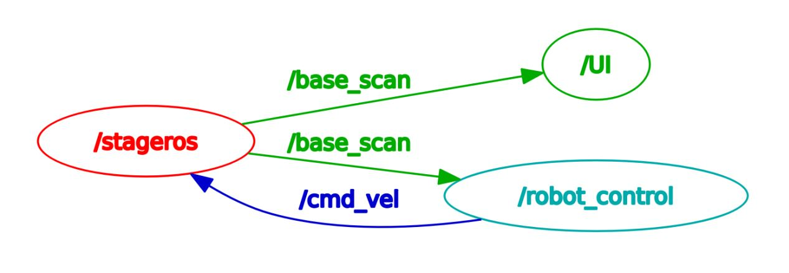

# Research Track 1 - Second Assignment 2021/2022

This a ROS package built in order to move a mobile robot inside a 2D circuit, in a simulator provided by professor [Carmine Recchiutto](http://github.com/CarmineD8).
In the assignment it was required to:
* move the robot, in a clockwise direction, using ROS inside the map;
* create 2 nodes: the first one to control the robot so it can autonomously complete a lap (avoiding to crash against the walls) and the second one to interact with the user while the robot is running;
* thanks to second node, the user should be able to increment/decrement the speed of the robot or reset its position to the start.

## Running

It's possible to download the workspace from the repository provided by the professor (http://github.com/CarmineD8/second_assignment) and it is needed a catkin_make command to create all the CMakeLists.txt and package.xml files. In the workspace it is possibile to find two folders I've created: `src` where there are the cpp scripts and `srv` where there is the description of the UI service message. To run the code we have to:
* run the command `roscore`, that is the master node;
* launch the map through the command `rosrun stage_ros stageros $(rospack find second_assignment)/world/my_world.world`; 
* run the control node, otherwise the robot won't move, through the command `rosrun second_assignment control_node`;
* run, if we desire to communicate with the robot (not mandatory, the robot will be able to complete a lap on his own), the interaction node through the command `rosrun second_assignment interaction_node` to be able tho change its speed/reset is position to the start.

After having launched all the nodes, the node graph will look like this: 

.

## Stageros node

The stageros node is subscribed to the `cmd_vel` topic, in order to read the linear (x, y, z) and angular (x, y, z) velocities and publishes on the `base_scan` topic, that gives information about the distance from the obstacles. We also used the `reset_position` service from the standard services `std_srvs` (we were interested in the `Empty` type service).

## Control node

The script associated to the control_node, is structured as follows:
* `main` function, where there are all the initializations and subscriptions to the topics and the definition of the server for the interaction aspect;
* `controllerCallback` function, where, after having acquired the distances to the walls, there are all the instructions to drive the robot safely through the map (that comprehends also the `check_wall` functions) to publish the velocity on the `cmd_vel` topic;
* `uiCallback` function, where we read the user input and manage the robots speed/position accordingly.

Here I report the flow chart of the code:

.

## Interaction node

The script associated to the interaction_node, is structured as follows:
* `main` function, where there are all the initializations, subscriptions to the topics and the definition of the client for the interaction aspect;
* `interactionCallback` function, where we send the command chosen by the user to the server
* `GetUserInput` function, where we print the rules for the user and acquire the input (`w` to increase the speed, `s` to decrease the speed and `r` o reset the robot's position).

Here I report the flow chart of the code:

.

## Conclusions

The robot is able to complete autonomously a lap of the circuit in about five minutes and, as far as I could see within a 10 minutes race, it was able to complete a second lap (so I think it is able to complete an infinite number of laps). If we increase drastically the speed, the robot will crush in the first turn of the circuit. The control of the robot seems pretty much good but it can be definitely perfected and also the user interface is very basic and not that much enjoyable. Overall, I think that it is still a good work. 